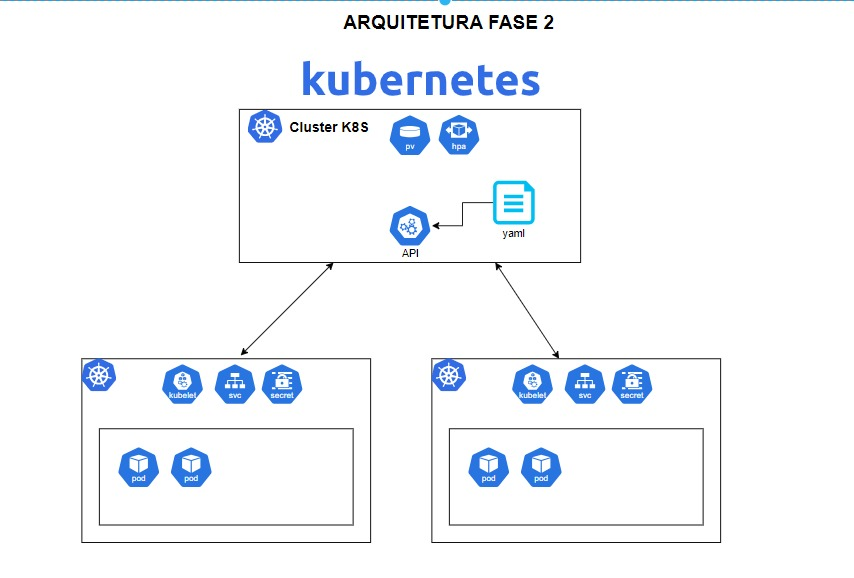

# fiap-food-api

API web de lanchonete de autoatendimento de fast food, que tem como objetivo, garantir que a lanchonete possa atender os clientes de maneira eficiente, gerenciando os pedidos de forna adequada.


# Entregável fase 04

Nesta fase vamos continuar trabalhando no projeto existente, e dando continuidade ao desenvolvimento do software para a lanchonete, teremos as seguintes melhorias e alterações:

1. Refatore o projeto separando em ao menos 3 (três) microsserviços. Alguns exemplos de serviços:
    - **Pedido**: responsável por operacionalizar o processo de pedidos, registrando os pedidos, retornando as informações necessárias para montar um pedido, listando os pedidos registrados e em processo de produção (visão de cliente).
    - **Pagamento**: responsável por operacionalizar a cobrança de um pedido, registrando a solicitação de pagamento, recebendo o retorno do processador de pagamento e atualizando o status do pedido.
    - **Produção**: responsável por operacionalizar o processo de produção do pedido, acompanhando a fila de pedidos (visão da cozinha), atualização de status de cada passo do pedido.

   Lembre-se de trabalhar com bancos de dados para cada aplicação. Use ao menos um banco de dados NoSQL e um SQL; caso queira fazer com mais bancos, você pode decidir quais utilizar.

   Os serviços devem se comunicar entre si, seja por chamada direta, mensagens em fila ou estratégias semelhantes. Um serviço não pode acessar o banco de dados de outro serviço, porque viola as regras de implementação de microsserviços.

2. Ao refatorar, os microsserviços devem conter testes unitários.
    - Ao menos um dos caminhos de teste deve implementar BDD.
    - Em todos os projetos, a cobertura de teste deve ser de 80%.

3. Seus repositórios devem ser separados para cada aplicação e devem respeitar as seguintes regras:
    - Main protegida.
    - PR para branch main, que deve validar o build da aplicação, e a qualidade de código via sonarqube ou qualquer outro serviço semelhante.
    - Automatize o deploy de todos seus microsserviços.

### Para essa fase 04 do projeto, estamos implementando os seguintes desafios:


### API - Requisitos Funcionais
* Refatoração do código para seguir os padrões clean code e clean architecture. <br>
* Endpoint para checkout do Pedido que recebe os produtos solicitados e retorna a identificação do pedido.<br>
* Endpoint para consulta de status do pagamento do pedido.<br>
* WebHook para receber a confirmação do pagamento.<br>
* Endpoint para retorno dos pedidos seguindo as seguintes regras: Pronto > Em Preparação > Recebido.<br>
* Endpoint para atualizar o status do pedido.

### Arquitetura em Kubernetes
* Escalabilidade com aumento e diminuição de Pods conforme demanda.

### Desenho da Arquitetura de Kubernetes


# Configuração do Ambiente
Para configurar o ambiente de desenvolvimento para este projeto Java, siga as instruções abaixo. Certifique-se de ter o Docker instalado em seu sistema antes de prosseguir.

## Pré-requisitos
* Docker instalado em sua máquina.

## Configurando o Ambiente

1 - Clone este repositório em sua máquina local.
```
git clone https://github.com/kenzleyDev/fiap-food-api.git 
```

1 - Clone o repositório fiap-payment em sua máquina local.
```
git clone https://github.com/guizin9/fiap-payment.git 
```
## Acesse o link abaixo para saber como subir o k8s:
[Youtube](https://www.youtube.com/watch?v=OCynASsCGOM)

## EM CASO DE ERRO COM O BANCO DE DADOS
* Verificar no application.properties da aplicação em src/main/resources se em spring.datasource.url: está apontando para o banco de dados disponibilizado no docker

## UTILIZANDO O SWAGGER
O Swagger proporciona uma interface interativa que facilita a exploração e entendimento dos endpoints disponíveis em nossa API. Para acessar o Swagger, basta seguir os passos abaixo:

1 - Após configurar o ambiente conforme as instruções anteriores, aguarde até que a aplicação esteja completamente inicializada.

2 - Abra o seu navegador da web e acesse:

```
http://localhost:8080/swagger-ui.html

```

## Utilizando com Ferramentas de Teste de API
Se preferir utilizar ferramentas como Postman, Insomnia ou outras, siga o tutorial abaixo para realizar as chamadas aos nossos serviços:


## Ordem de Execução da API:
* 1° (Opcional) Cadastrar um Cliente
* 2° Cadastrar Categoria
* 3° Cadastrar Produto
* 4° Cadastrar o Pedido

## Consumindo API de Clientes (Customer)

### Cadastrar um Cliente:

Para cadastrar um cliente, envie uma requisição POST para:

```
localhost:8080/api/v1/customers
```
Ex:
```json
{
    "name": "Cliente teste",
    "cpf": "22222222222222222",
    "email": "cliente@mail.com",
    "password": "teste"
}
````
### Buscar um Cliente pelo CPF:
Para buscar um cliente pelo CPF, envie uma requisição GET para:

```
localhost:8080/api/v1/customers/identify/{cpf}
```

## Consumindo API de Produtos(Products)

### Cadastrar um Produto
Antes de criar um produto, certifique-se de que a categoria do produto está cadastrada. Caso não esteja, utilize:
```
localhost:8080/api/v1/category

```
Para cadastrar um produto, envie uma requisição POST para:

```
localhost:8080/api/v1/products
```

Exemplo de corpo da requisição:
```json
{
    "name": "Sorvete",
    "price": 12.0,
    "nameCategory": "Sobremesas",
    "information": "leite, chocolate",
    "quantity": 2
}
```

### Editar um Produto:
Para editar um produto, envie uma requisição PUT para:

```
localhost:8080/api/v1/products/{id}
````

Inclua as informações de edição no corpo da requisição.
Ex:
```json
{
    "name": "Hamburguer Editado",
    "price": 12.0,
    "nameCategory": "Lanches",
    "information": "Carne, presunto, queijo, ovo, calabresa, alface e tomate",
    "quantity": 2
}
```

### Deletar um Produto:
Para deletar um produto, envie uma requisição DELETE para:

```
localhost:8080/api/v1/products/{id}
```

### Buscar um Produto por Categoria:
Para buscar produtos por categoria, envie uma requisição GET para:

```
localhost:8080/api/v1/products/category/{categoryName}
```

##Consumindo API de Categorias (Category)

### Cadastrar uma Categoria:
Para cadastrar uma categoria, envie uma requisição POST para:

```
localhost:8080/api/v1/category
```

Exemplo de corpo da requisição:
```json
{
    "name": "Bebidas"
}
```

## Consumindo API de Pedidos (Order)
### Criar um Pedido:
Para criar um pedido, envie uma requisição POST para:

```
localhost:8080/api/v1/orders
```

Inclua as informações do pedido no corpo da requisição. O CPF do cliente é opcional, porém, para utilizar é preciso está cadastrado


Exemplo de corpo da requisição:
```json
{
  "cpfCustomer": "",
  "productsName": ["Sorvete", "Hamburguer", "Coca Cola"]
}

ou

{
  "cpfCustomer": "12345678910",
  "productsName": ["Sorvete", "Hamburguer", "Coca Cola"]
}
```
### Buscar todos os Pedidos:
Para buscar todos os pedidos, envie uma requisição GET para:

```
localhost:8080/api/v1/orders
```

## Consumindo API Fake-Checkout
Ao criar um pedido, um atributo chamado "confirmationCode" é gerado como um token vinculado ao pedido.

### Buscar um Pedido através de seu ConfirmationCode:
Para buscar um pedido através do confirmationCode, envie uma requisição GET para:

```
localhost:8080/api/v1/orders/{confirmationCode}
```


### Atualizar Status de um Pedido para CONFIRMADO (CONFIRMED):
Para atualizar o status de um pedido para CONFIRMADO, envie uma requisição PUT para:

```
localhost:8080/api/v1/orders/{confirmationCode}
````


### Atualizar Status de um Pedido: 
Para atualizar o status de um pedido, envie uma requisição PUT para
```
localhost:8080/api/v1/orders/status/{confirmationCode}

````
### status suportados: 
* RECEIVED
* IN_PREPARATION
* READY
* FINISHED
* CANCELED

### Buscar Status de pagamento de um Pedido:
Para atualizar o status de pagamento de um pedido, envie uma requisição GET para
```
localhost:8080/api/v1/payment/status/{confirmationCode}

````